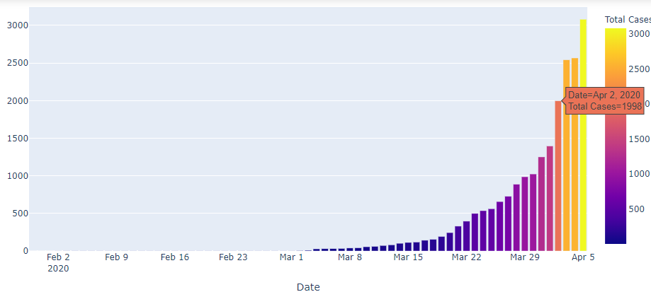
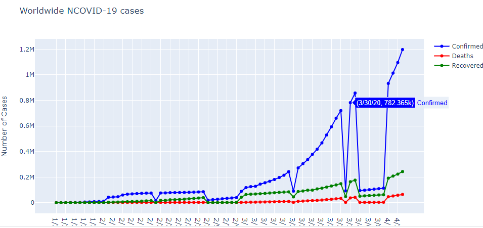
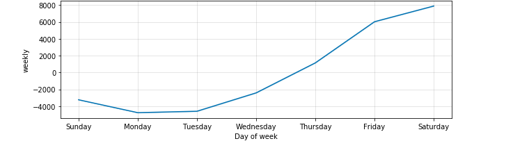
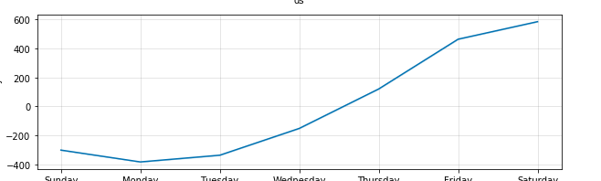

# COVID-19

This model is all about analyzing how the virus could spread across different countries and regions .The main objective of this task is to build a model that predicts the spread of virus in next 7 days.

## DATA SOURCES

  Timeseries  
  Kaggle  

## SCREENSHOTS

### 1. Cases in India

### 2. Worldwide COVID-19 Cases

### 3. Confirmed Cases (Predicted)

### 4. Death Cases (Predicted)

